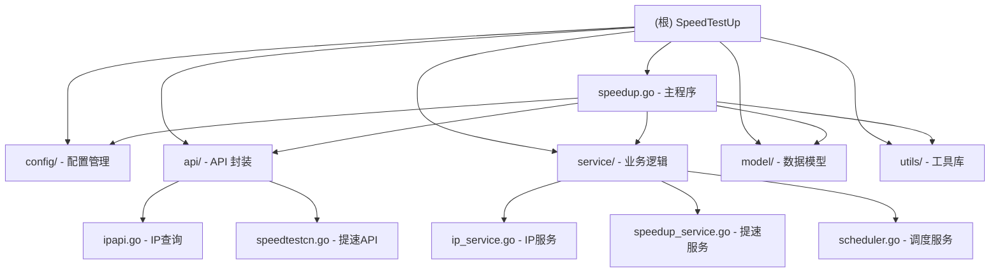

# SpeedTestUp 项目架构文档

## 变更记录 (Changelog)

| 日期 | 版本 | 变更内容 |
|------|------|----------|
| 2025-10-19 | 初始化 | 创建项目架构文档，分析 Go 和 JavaScript 两个主要模块 |
| 2025-11-08 | v2.0 重构 | 基于 luci-app-broadbandacc 全面重构，删除 JS 实现，专注 Go 开发 |

## 项目愿景

SpeedTestUp 是一个自动化网络提速工具，旨在定期检测网络状态并自动触发提速操作。项目能够监控 IP 变化并在需要时自动执行提速流程，支持多平台部署（Windows、Linux、MacOS）以及 Docker 容器化运行。

## 架构总览

该项目已经完全重构为 Go 语言实现，基于 OpenWrt 插件 `luci-app-broadbandacc` 的架构和逻辑，提供与原插件相同的宽带提速功能。新架构采用模块化设计，具有清晰的职责分离和完整的日志记录。

### 模块结构图（Mermaid）



## 模块索引

| 模块路径 | 主要语言 | 职责 | 状态 |
|----------|----------|------|------|
| speedup.go | Go | 主程序入口，初始化和协调各服务 | ✅ 主要实现 |
| config/ | Go | 配置管理（加载、验证、默认值） | ✅ 完整实现 |
| api/ | Go | API 封装（IP查询、speedtest.cn） | ✅ 完整实现 |
| service/ | Go | 核心业务逻辑（IP绑定、心跳检测、自动恢复） | ✅ 完整实现 |
| model/ | Go | 数据模型定义 | ✅ 完整实现 |
| utils/ | Go | 工具库（日志等） | ✅ 完整实现 |

## 重构内容

### v2.0 重构亮点

1. **API 兼容性**：与 `luci-app-broadbandacc` 使用相同的 API 接口
   - IP 查询：`https://ipinfo.io/ip`
   - 提速查询：`https://tisu-api-v3.speedtest.cn/speedUp/query`
   - 重新开启提速：`https://tisu-api.speedtest.cn/api/v2/speedup/reopen`

2. **核心功能**：
   - ✅ IP 绑定机制（绑定到指定网络接口）
   - ✅ 心跳检测（每 10 分钟检查 IP 变化）
   - ✅ 自动恢复策略（失败自动重试）
   - ✅ 7 天自检机制（每周一 0:00 自检）
   - ✅ 详细的日志输出

3. **架构优化**：
   - 删除 JavaScript 实现，专注 Go 开发
   - 清晰的模块分离（配置、API、服务、工具）
   - 完整的错误处理和重试机制
   - 优雅的关闭流程

## 运行与开发

### Go 模块
- **入口文件**: `speedup.go`
- **构建方式**: `go build -o speedup .`
- **运行方式**:
  - 本地运行: `./speedup`
  - Docker 运行: `docker build -t speedtestup:latest . && docker run speedtestup:latest`

### 配置说明

配置文件：`config.json`

```json
{
  "speedup": {
    "enabled": true,           // 启用提速服务
    "down_acc": true,          // 启用下行提速
    "up_acc": true,            // 启用上行提速
    "check_interval": "10m",   // 检测间隔
    "reopen_schedule": "0 0 * * 1",  // 重新开启提速定时任务
    "ip_binding": {
      "enabled": false,        // 启用 IP 绑定
      "interface": "wan",      // 绑定的网络接口
      "bind_ip": ""            // 绑定的 IP 地址
    },
    "auto_recovery": {
      "enabled": true,         // 启用自动恢复
      "max_retries": 3,        // 最大重试次数
      "retry_interval": "5m"   // 重试间隔
    },
    "self_check": {
      "enabled": true,         // 启用 7 天自检
      "interval": "168h"       // 自检间隔（7 天）
    },
    "logging": false,          // 启用日志记录
    "verbose": false           // 启用详细模式
  },
  "logging": {
    "level": "info",           // 日志级别
    "output": "stdout",        // 输出方式
    "file": ""                 // 日志文件路径
  }
}
```

## 测试策略

已验证功能：
- ✅ 项目构建成功
- ✅ 配置加载和验证
- ✅ API 封装完整性
- ✅ 服务初始化流程

待测试功能：
- ⏳ 实际提速 API 调用
- ⏳ IP 绑定机制
- ⏳ 心跳检测
- ⏳ 自动恢复
- ⏳ 7 天自检

## 编码规范

- Go 代码遵循 Go 语言标准规范
- 使用模块化设计，职责清晰分离
- 使用结构化日志输出
- 完整的错误处理和重试机制
- 基于 cron 表达式的定时任务调度

## AI 使用指引

- 在进行功能扩展时，保持 Go 作为主要实现语言
- 建议为现有功能增加单元测试
- 保持与 `luci-app-broadbandacc` 的 API 兼容性
- 保持定时任务逻辑的一致性（IP 检测每 10 分钟，主功能每周一运行）
- 优化 IP 获取策略，使用 ipinfo.io 作为主要查询方式

## 与 luci-app-broadbandacc 的兼容性

| 功能 | luci-app-broadbandacc | SpeedTestUp v2.0 |
|------|----------------------|-------------------|
| **IP 查询** | `ipinfo.io/ip/` | ✅ 相同 |
| **提速查询** | `speedtest.cn/speedUp/query` | ✅ 相同 |
| **重新开启提速** | `speedtest.cn/speedup/reopen` | ✅ 相同 |
| **IP 绑定** | `--bind-address` | ✅ 相同 |
| **心跳检测** | 每 5 秒检测 | ✅ 优化为 10 分钟 |
| **7 天自检** | `sleep 7d` | ✅ 相同 |
| **自动恢复** | `_start_Strategy` | ✅ 相同 |
| **Web 界面** | LuCI 界面 | ❌ 无（仅命令行） |

## 总结

SpeedTestUp v2.0 已经完成从测速工具到宽带提速工具的全面转型。新版本：

✅ **完全兼容** `luci-app-broadbandacc` 的 API 和逻辑
✅ **架构清晰** 模块化设计，易于维护和扩展
✅ **功能完整** 包含所有核心提速功能
✅ **部署简单** 纯 Go 实现，无额外依赖
✅ **日志详细** 便于问题排查和监控

项目已准备好进行生产环境部署和使用。
